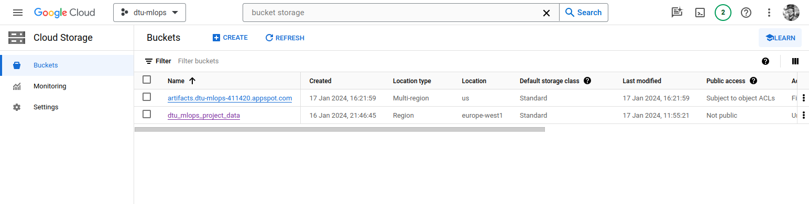

# Exam template for 02476 Machine Learning Operations

This is the report template for the exam. Please only remove the text formatted as with three dashes in front and behind
like:

```--- question 1 fill here ---```

where you instead should add your answers. Any other changes may have unwanted consequences when your report is auto
generated in the end of the course. For questions where you are asked to include images, start by adding the image to
the `figures` subfolder (please only use `.png`, `.jpg` or `.jpeg`) and then add the following code in your answer:

```markdown

```

In addition to this markdown file, we also provide the `report.py` script that provides two utility functions:

Running:

```bash
python report.py html
```

will generate an `.html` page of your report. After deadline for answering this template, we will autoscrape
everything in this `reports` folder and then use this utility to generate an `.html` page that will be your serve
as your final handin.

Running

```bash
python report.py check
```

will check your answers in this template against the constrains listed for each question e.g. is your answer too
short, too long, have you included an image when asked to.

For both functions to work it is important that you do not rename anything. The script have two dependencies that can
be installed with `pip install click markdown`.

## Overall project checklist

The checklist is *exhaustic* which means that it includes everything that you could possible do on the project in
relation the curricilum in this course. Therefore, we do not expect at all that you have checked of all boxes at the
end of the project.

### Week 1

* [x] Create a git repository
* [x] Make sure that all team members have write access to the github repository
* [x] Create a dedicated environment for you project to keep track of your packages
* [x] Create the initial file structure using cookiecutter
* [x] Fill out the `make_dataset.py` file such that it downloads whatever data you need and
* [x] Add a model file and a training script and get that running
* [x] Remember to fill out the `requirements.txt` file with whatever dependencies that you are using
* [x] Remember to comply with good coding practices (`pep8`) while doing the project
* [x] Do a bit of code typing and remember to document essential parts of your code
* [x] Setup version control for your data or part of your data
* [x] Construct one or multiple docker files for your code
* [x] Build the docker files locally and make sure they work as intended
* [x] Write one or multiple configurations files for your experiments
* [x] Used Hydra to load the configurations and manage your hyperparameters
* [ ] When you have something that works somewhat, remember at some point to to some profiling and see if
      you can optimize your code
* [x] Use Weights & Biases to log training progress and other important metrics/artifacts in your code. Additionally,
      consider running a hyperparameter optimization sweep.
* [x] Use Pytorch-lightning (if applicable) to reduce the amount of boilerplate in your code

### Week 2

* [x] Write unit tests related to the data part of your code
* [x] Write unit tests related to model construction and or model training
* [x] Calculate the coverage.
* [x] Get some continuous integration running on the github repository
* [x] Create a data storage in GCP Bucket for you data and preferable link this with your data version control setup
* [x] Create a trigger workflow for automatically building your docker images
* [x] Get your model training in GCP using either the Engine or Vertex AI
* [x] Create a FastAPI application that can do inference using your model
* [ ] If applicable, consider deploying the model locally using torchserve
* [ ] Deploy your model in GCP using either Functions or Run as the backend

### Week 3

* [ ] Check how robust your model is towards data drifting
* [ ] Setup monitoring for the system telemetry of your deployed model
* [ ] Setup monitoring for the performance of your deployed model
* [ ] If applicable, play around with distributed data loading
* [ ] If applicable, play around with distributed model training
* [ ] Play around with quantization, compilation and pruning for you trained models to increase inference speed

### Additional

* [ ] Revisit your initial project description. Did the project turn out as you wanted?
* [x] Make sure all group members have a understanding about all parts of the project
* [x] Uploaded all your code to github

## Group information

### Question 1
> **Enter the group number you signed up on <learn.inside.dtu.dk>**
>
> Answer:

66

### Question 2
> **Enter the study number for each member in the group**
>
> Example:
>
> *sXXXXXX, sXXXXXX, sXXXXXX*
>
> Answer:

*s240506, s237248, s137345*

### Question 3
> **What framework did you choose to work with and did it help you complete the project?**
>
> Answer length: 100-200 words.
>
> Example:
> *We used the third-party framework ... in our project. We used functionality ... and functionality ... from the*
> *package to do ... and ... in our project*.
>
> Answer:

We used [torchaudio](https://pytorch.org/audio/stable/index.html) and [gradio](https://www.gradio.app/) as our third-party frameworks.
Torchaudio provides functionalities to load audio-related datasets and specific audio transformations to preprocess and augment audio data.
Specifically, we used the `torchaudio.datasets.SPEECHCOMMANDS` dataset to load the data and the `torchaudio.transforms.[Spectrogram|FrequencyMasking|MelScale]` transformations, which allowed us to extract two-dimensional features from the audio data, which could then be processed by conventional computer vision models such as CNNs
Although being part of the PyTorch ecosystem, torchaudio is not part of the PyTorch core library, and arguably less popular than its computer vision counterpart, torchvision.
Compared to other similar libraries such as _librosa_ or _scipy.signal_, the transformations included in torchaudio can run on the GPU, allowing them to be executed on the fly during training.
Gradio is a library that allows to quickly create web-based interfaces for machine learning models, leveraging a number of built-in widgets to display and interact with the model.
Specifically, we used the `gradio.Audio` component to load waveforms into the model, and the `gradio.Label` component to display the model's predictions.

## Coding environment

> In the following section we are interested in learning more about you local development environment.

### Question 4

> **Explain how you managed dependencies in your project? Explain the process a new team member would have to go**
> **through to get an exact copy of your environment.**
>
> Answer length: 100-200 words
>
> Example:
> *We used ... for managing our dependencies. The list of dependencies was auto-generated using ... . To get a*
> *complete copy of our development environment, one would have to run the following commands*
>
> Answer:

We used a combination of `conda` and `pip` to manage our dependencies.
We used `conda` to create a virtual environment and install any external dependencies that are not python-specific, such as FFMPEG.
We used `pip` to install any python-specific dependencies, such as `torch` and `hydra`, etc; all the dependencies are listed in the `requirements.txt` and `requirements_dev.txt` files.
This way, our repository acts as a self-contained package that can be installed using `pip`, and any dependency will be installed automatically.
The commands to install the dependencies are:
```bash
conda create -n dtu_mlops_project python=3.11
conda activate dtu_mlops_project
conda install -c conda-forge 'ffmpeg<7'
pip install -e .
pip install -r requirements_dev.txt # optional, for development/tests
```

### Question 5

> **We expect that you initialized your project using the cookiecutter template. Explain the overall structure of your**
> **code. Did you fill out every folder or only a subset?**
>
> Answer length: 100-200 words
>
> Example:
> *From the cookiecutter template we have filled out the ... , ... and ... folder. We have removed the ... folder*
> *because we did not use any ... in our project. We have added an ... folder that contains ... for running our*
> *experiments.*
> Answer:

We based our project partially on the [cookiecutter-data-science/](https://drivendata.github.io/cookiecutter-data-science/), and partially on the [lightning-hydra-template](https://github.com/ashleve/lightning-hydra-template), resulting in a custom project structure. A detailed overview is provided in the root level [README.md](https://github.com/borisrakovan/dtu-mlops-project/blob/main/README.md) of the project. The core structure consists of the source code in dtu_mlops_project/, split into data/, models/ and visualiazation/. The main scripts, train_model.py and predict_model.py are located within models/. data/ contains the data downloading and pre-procesing scripts, the contents of visualization/ are self-explanatory. Most other directories and files are located in the root directory. An important feature of this repository is the configs/ directory which contains the instructions and settings for nearly all repository functionality, following Hydra's hierarchical config structure. The folders from the template which we did not use, we ended up deleting for clarity, folders which are used but are listed in the .gitignore, were made visible to the version control system by adding .gitkeep files in those directories (e.g. data/raw/).

### Question 6

> **Did you implement any rules for code quality and format? Additionally, explain with your own words why these**
> **concepts matters in larger projects.**
>
> Answer length: 50-100 words.
>
> Answer:

We use [ruff](https://docs.astral.sh/ruff/) to enforce code quality and formatting.
Ruff implements a number of rules taken from other linters such as Flake8 and Pylint, with the advantage of being much faster.
We integrated ruff in our git workflow, so that it is run automatically on every commit, along with additional checks such as trailing whitespace and end-of-file newline.
These additional checks are useful to avoid unnecessary clutter in the git history, and to avoid merge conflicts due to blank spaces.
Furthermore, we integrated ruff in our CI pipeline, so that it is run on every pull request.

## Version control

> In the following section we are interested in how version control was used in your project during development to
> corporate and increase the quality of your code.

### Question 7

> **How many tests did you implement and what are they testing in your code?**
>
> Answer length: 50-100 words.
>
> Example:
> *In total we have implemented X tests. Primarily we are testing ... and ... as these the most critical parts of our*
> *application but also ... .*
>
> Answer:

We implemented tests for model construction, as well as data preprocessing and augmentation during both training and testing.
Furthermore, since the objects instantiated in the tests get their configuration from the `hydra` configuration files, we also indirectly verify that the configuration files are valid.
We initially implemented a test for the entire training pipeline, but it was deemed too slow and resource-intensive to run in the CI pipeline; this was removed in commit [0fb85a5](https://github.com/borisrakovan/dtu-mlops-project/commit/0fb85a502f2bf7bc3f09c2ec34b172bcf92d0547).

### Question 8

> **What is the total code coverage (in percentage) of your code? If you code had an code coverage of 100% (or close**
> **to), would you still trust it to be error free? Explain you reasoning.**
>
> Answer length: 100-200 words.
>
> Example:
> *The total code coverage of code is X%, which includes all our source code. We are far from 100% coverage of our **
> *code and even if we were then...*
>
> Answer:

Our total test coverage is 13%. We're far from 100% coverage but even if we were close then it wouldn't mean our code is
bug free. The code coverage is a reliable metric only as long as the tests are reliable and test the right things.
For example, if we had a test that only tested that the model is constructed without errors, but not that it is trained
correctly, then the code coverage would be high but the test would not be very useful. Furthermore, the code coverage
does not test the correctness of the code, only that it is executed.

### Question 9

> **Did you workflow include using branches and pull requests? If yes, explain how. If not, explain how branches and**
> **pull request can help improve version control.**
>
> Answer length: 100-200 words.
>
> Example:
> *We made use of both branches and PRs in our project. In our group, each member had an branch that they worked on in*
> *addition to the main branch. To merge code we ...*
>
> Answer:

We handled the development of each feature in separate branches, using pull requests to merge into main.
We used the "review" feature to review each other's code and discuss additional modifications before finalizing.
Since we haven't deployed a fully operational version of the repository, we refrained for using a dev branch. In a production scenario, we would have implemented a dev branch in between the main branch and the (short-lived) feature branches, merging the feature branches with dev and only merging dev with main upon large relevant changes and extensive testing.
An example scenario in our collaborative workflow could be:
1. Group member **A** is assigned the task of implementing wandb logging.
2. **A** creates a new local branch `add-wandb` and starts implementing the feature.
3. **A** pushes the changes to the remote branch.
4. Occasionally, **A** fetches changes from the main branch and integrates them into the local branch, using rebase.
5. Once done, **A** creates a pull request and assigns it for review.
6. The reviewer(s) can comment on the code and request changes
7. Steps 3 to 6 are repeated until the reviewer(s) approve the PR.
8. The PR is merged into the main branch.

### Question 10

> **Did you use DVC for managing data in your project? If yes, then how did it improve your project to have version**
> **control of your data. If no, explain a case where it would be beneficial to have version control of your data.**
>
> Answer length: 100-200 words.
>
> Example:
> *We did make use of DVC in the following way: ... . In the end it helped us in ... for controlling ... part of our*
> *pipeline*
>
> Answer:

We did use DVC to manage the data in our project. We added our training data to DVC, and versioned it. We stored the data in a Cloud Storge Bucket and access it in a docker container using DVC. We did not use the version control functionality of DVC, as we did not have different versions of the training data, but if this were a real evolving project it would be likely that the training data would increase or be modified in time, and then using DVC would allow to specify which version of the trainig data to use during training.

### Question 11

> **Discuss you continues integration setup. What kind of CI are you running (unittesting, linting, etc.)? Do you test**
> **multiple operating systems, python version etc. Do you make use of caching? Feel free to insert a link to one of**
> **your github actions workflow.**
>
> Answer length: 200-300 words.
>
> Example:
> *We have organized our CI into 3 separate files: one for doing ..., one for running ... testing and one for running*
> *... . In particular for our ..., we used ... .An example of a triggered workflow can be seen here: <weblink>*
>
> Answer:

As part of our CI setup, we have set up unit testing using pytest, linting using ruff (also with pre-commit) in [ci.yml](https://github.com/borisrakovan/dtu-mlops-project/blob/main/.github/workflows/ci.yml). Furthermore, in a different file, we automated docker image build using [cloudbuild.yml](https://github.com/borisrakovan/dtu-mlops-project/blob/main/cloudbuild.yml). We have not implemented tests for different OSs or Python versions, because our aim is to use the repository for running experiments and deploying the model within docker containers featuring a predefined environment (Linux and Python 3.11). Therefore, there is no need to test it for other OSs. To speed up CI execution, we use the caching feature for our pip requirements; this prevents having to re-download the dependencies every time CI is called.


## Running code and tracking experiments

> In the following section we are interested in learning more about the experimental setup for running your code and
> especially the reproducibility of your experiments.

### Question 12

> **How did you configure experiments? Did you make use of config files? Explain with coding examples of how you would**
> **run a experiment.**
>
> Answer length: 50-100 words.
>
> Example:
> *We used a simple argparser, that worked in the following way: python my_script.py --lr 1e-3 --batch_size 25*
>
> Answer:

We used Hydra to manage the configuration.
We follow a composable hierarchical structure, based on the following elements: `datamodule`, `model`, `trainer`, and `logger`.
We have two root files: `configs/train.yaml` and `configs/infer.yaml`, which are used during training and inference, respectively.
Each element can have one or more configuration files: for example, the `model` sub-group has configuration files `configs/model/resnet34.yaml` and `configs/model/resnet50.yaml`.
This allows us to easily swapt models and datasets in an experiment.
Furthermore, sub-groups can share variables using the `${group.varname}` syntax, avoiding needless repetitions.
Finally, each configuration argument can be overridden from the command line, e.g. `train_model.py run_name=highLR_bigBS model.learning_rate=1e-2 datamodule.batch_size=2048`.


### Question 13

> **Reproducibility of experiments are important. Related to the last question, how did you secure that no information**
> **is lost when running experiments and that your experiments are reproducible?**
>
> Answer length: 100-200 words.
>
> Example:
> *We made use of config files. Whenever an experiment is run the following happens: ... . To reproduce an experiment*
> *one would have to do ...*
>
> Answer:

We logged our experiments using Weights & Biasis (wandb), either locally or form the cloud. Every training run was stored, the stored output includes the best weights of the run, the conda environment.yml & requirements.txt but also the hydra hyperparameter configuration (see answer to Q12). We also made use of docker to ensure there are no operating system dependent influences, and we use dvc to track the version of the trainingdata. To reproduce a specific training run or trained model, one would clone the repository, build the docker contrainer 'train.dockerfile' (which install the proper env), specify the proper (hyperparameter-)setting which are obtained from WandB and download the correct version of the data using dvc. With all these components the training is explicitly defined (after seeding the random initialization of weights at the beginning of training, which is included in the configs).

### Question 14

> **Upload 1 to 3 screenshots that show the experiments that you have done in W&B (or another experiment tracking**
> **service of your choice). This may include loss graphs, logged images, hyperparameter sweeps etc. You can take**
> **inspiration from [this figure](figures/wandb.png). Explain what metrics you are tracking and why they are**
> **important.**
>
> Answer length: 200-300 words + 1 to 3 screenshots.
>
> Example:
> *As seen in the first image when have tracked ... and ... which both inform us about ... in our experiments.*
> *As seen in the second image we are also tracking ... and ...*
>
> Answer:


As seen in the first image, we did multiple runs, both locally and using Google Cloud Compute Engine, with similar sets of hyperparameters. As the focus was on the MLOps pipeline around the model, we did not focus too much on optimizing the model. We did several dummy training runs to test several parts of our pipeline, like docker containers and Vitual Machines. To be able to develop the inference part while setting up the cloud training we did locally train the model for three epochs in order to obtain a model with reasonably good performance. Our model used for inference achieved an accuracy of 93%, which is quite high considering that we have treated audio data as imagery, thereby discarding the temporal information which is the most valuable feature for classification of audio data, which is why RNNs are more commonly applied. We logged the accuracy and loss for the training, validation and test sets. We did not log images using W&B, but we did set up an inference script which allowed for visual comparison of the input data, pre-processed data, the model prediction, the true label and the distribution of probabilities of the 35 classes in our SpeechCommands dataset, shown in the second figure.

### Question 15

> **Docker is an important tool for creating containerized applications. Explain how you used docker in your**
> **experiments? Include how you would run your docker images and include a link to one of your docker files.**
>
> Answer length: 100-200 words.
>
> Example:
> *For our project we developed several images: one for training, inference and deployment. For example to run the*
> *training docker image: `docker run trainer:latest lr=1e-3 batch_size=64`. Link to docker file: <weblink>*
>
> Answer:

We mainly use docker for consolidation of the training script, together with the dependencies and the trainingdata, into a configuration that is easy and convenient to use both locally and in the cloud. The dockerfile is linked to here: [docker/train.dockerfile](https://github.com/borisrakovan/dtu-mlops-project/blob/add-report/docker/train.dockerfile). We complete workflow by using a Makefile for each of the major processes. We have implemented a cloudbuild.yml workflow to automatically (re-)build our docker image when the main branch is pushed and publish it to our project Container Registry on Google Cloud.
There are several ways to run the docker images. First one can clone the repository and build a new image, this image can then be run locally to create a docker container. Another use case is to pull the latest (CI-generated) image from the Container Registry, and then build it locally or when on a Virtual Machine (for example with Google Cloud Compute Engine).

### Question 16

> **When running into bugs while trying to run your experiments, how did you perform debugging? Additionally, did you**
> **try to profile your code or do you think it is already perfect?**
>
> Answer length: 100-200 words.
>
> Example:
> *Debugging method was dependent on group member. Some just used ... and others used ... . We did a single profiling*
> *run of our main code at some point that showed ...*
>
> Answer:

The major safeguard against bugs is our feature branch + pull request workflow (detailed in Answer 9). New code is reviewed by one or more members of the team before it is added to the main branch. This approach allows for other team members to run the new version of the code first to test it (and also encounter e.g. any os specific issues or hardcoded filepaths). Suggestions for improvements were made as comments on the pull request. We did not profile our code, but we also certainly do not think it was perfect, we simply chose to allocate more time to other parts of the project.

## Working in the cloud

> In the following section we would like to know more about your experience when developing in the cloud.

### Question 17

> **List all the GCP services that you made use of in your project and shortly explain what each service does?**
>
> Answer length: 50-200 words.
>
> Example:
> *We used the following two services: Engine and Bucket. Engine is used for... and Bucket is used for...*
>
> Answer:

We used the following of Google Cloud Platform's services: Compute Engine, Cloud Storage, Container Registry, and Cloud Build, and Vertex AI. Compute Engine was used for creating Virtual Machines to run our docker containers and to perform training in the cloud. Cloud Storage is used to store our training dataset (which is version controlled using dvc) and to store a trained version of the model which is used for prediction (using FastAPI). The Cloud Build is the CI endpoint of our CI workflow that was specified in cloudbuild.yml, that is: when a branch is pushed, the dockerfile is built into a docker image, which is then pushed to Cloud Build, from where it can be pulled from anywhere and can then be ran to construct a corresponding container. Container Registry was used to automatically build containers.

### Question 18

> **The backbone of GCP is the Compute engine. Explained how you made use of this service and what type of VMs**
> **you used?**
>
> Answer length: 100-200 words.
>
> Example:
> *We used the compute engine to run our ... . We used instances with the following hardware: ... and we started the*
> *using a custom container: ...*
>
> Answer:

We used Compute Engine to run several processes within Google Cloud. At first we used VMs to test how well our developed core model-training code was generalized. Later we used it to launch our docker containers and perform training in the cloud. We also used it to deploy our model remotely (after implementing it locally). We used instances from the deeplearning platform release and pytorch image family, both CPU and GPU. We both worked with the Virtual Machines interactively, and also directly launched docker containers with entrypoints. The docker containers were set up to download the training data and in case of inference also a trained model from Cloud Storage.

### Question 19

> **Insert 1-2 images of your GCP bucket, such that we can see what data you have stored in it.**
> **You can take inspiration from [this figure](figures/bucket.png).**
>
> Answer:



### Question 20

> **Upload one image of your GCP container registry, such that we can see the different images that you have stored.**
> **You can take inspiration from [this figure](figures/registry.png).**
>
> Answer:


### Question 21

> **Upload one image of your GCP cloud build history, so we can see the history of the images that have been build in**
> **your project. You can take inspiration from [this figure](figures/build.png).**
>
> Answer:


### Question 22

> **Did you manage to deploy your model, either in locally or cloud? If not, describe why. If yes, describe how and**
> **preferably how you invoke your deployed service?**
>
> Answer length: 100-200 words.
>
> Example:
> *For deployment we wrapped our model into application using ... . We first tried locally serving the model, which*
> *worked. Afterwards we deployed it in the cloud, using ... . To invoke the service an user would call*
> *`curl -X POST -F "file=@file.json"<weburl>`*
>
> Answer:

We deployed our model using FastAPI, which allows to easily wrap a model into a web application.
Our FastAPI application is defined in `webapp/main.py`, and is configured using hydra and the `configs/infer.yaml` configuration file.
The application features one main endpoint, `/predict_audio`, available as a POST request, where the user can upload an audio file (as a `multipart/form-data` form) and receive the model's prediction as a JSON response, consisting of the predicted class, its index, and the model's logits for all the classes.
The application can be deployed locally using `make web-api` and queried using:
```
curl -X 'POST' \
  'http://0.0.0.0:8001/predict_audio/' \
  -H 'accept: application/json' \
  -H 'Content-Type: multipart/form-data' \
  -F 'data=@path/to/audio_file.wav;type=audio/wav'
```

### Question 23

> **Did you manage to implement monitoring of your deployed model? If yes, explain how it works. If not, explain how**
> **monitoring would help the longevity of your application.**
>
> Answer length: 100-200 words.
>
> Example:
> *We did not manage to implement monitoring. We would like to have monitoring implemented such that over time we could*
> *measure ... and ... that would inform us about this ... behaviour of our application.*
>
> Answer:

We did not implement monitoring of our deployed model. Monitoring would help ensure proper operations, also long after training. We would have implemented monitoring to check the performance of our model over time, to observe whether model decay would take place. A reason for this could be data drifting, which is quite likely in our case of speech audio data. Our model is trained on 35 classes, 35 different words, that are quite well balance in occurance. If users would use our UI (via FastAPI) to interact with the model, we could exploit that data to further train the model (in case we manually label the new data), if one of the classes is occuring more frequently than the others, or more noisy audio data is fed to the model (if we would implement some form of continuous training) the performance could decrease over time. Monitoring could help notify us when this happens, such that we can retrain the model to bring the performance back up to the required level.


### Question 24

> **How many credits did you end up using during the project and what service was most expensive?**
>
> Answer length: 25-100 words.
>
> Example:
> *Group member 1 used ..., Group member 2 used ..., in total ... credits was spend during development. The service*
> *costing the most was ... due to ...*
>
> Answer:

We used 1.80 EUR in total, of which 1.13 EUR was used on Cloud Storage and the rest on Compute Engine and networking.
The most expensive service was GCS due to the volume of data we had to store there (both the dataset and the trained models).

## Overall discussion of project

> In the following section we would like you to think about the general structure of your project.

### Question 25

> **Include a figure that describes the overall architecture of your system and what services that you make use of.**
> **You can take inspiration from [this figure](figures/overview.png). Additionally in your own words, explain the**
> **overall steps in figure.**
>
> Answer length: 200-400 words
>
> Example:
>
> *The starting point of the diagram is our local setup, where we integrated ... and ... and ... into our code.*
> *Whenever we commit code and puch to github, it auto triggers ... and ... . From there the diagram shows ...*
>
> Answer:

--- question 25 fill here ---

### Question 26

> **Discuss the overall struggles of the project. Where did you spend most time and what did you do to overcome these**
> **challenges?**
>
> Answer length: 200-400 words.
>
> Example:
> *The biggest challenges in the project was using ... tool to do ... . The reason for this was ...*
>
> Answer:

One of the biggest challenges was figuring out a suitable workflow for data and artifact handling. Specifically, we wanted to use DVC to version the data, and W&B to store logs, but also wanted to easily access the trained models and checkpoints, so that they could be deployed later.
The solution we came up with was to store the dataset in a GCP bucket, as a single ZIP archive, and use DVC to version it; this way, we could easily access the data both locally and from the cloud.
For checkpoints, we decided to simply store them in the same bucket.
Another challenge consisted in enabling cloud training from the Google Compute Engine platform.
This is because, on a GCE instance, certain interactive setup steps are more difficult to perform, such as logging in to W&B or GCP, or downloading the dataset.
Furthermore, we had to figure out how to integrate the dataset into the docker image, so that it could be used during training.
Initially, we attempted at integrating the dataset into the docker image, so that it would only need to be downloaded once, i.e. during the image build.
However, we faced an issue whereby the dataset was available in the locally-built image but not in the remotely-built one.
Furthermore, figuring out the exact requirements for the VM instance was also particularly challenging, especially due to its trial-and-error nature.


### Question 27

> **State the individual contributions of each team member. This is required information from DTU, because we need to**
> **make sure all members contributed actively to the project**
>
> Answer length: 50-200 words.
>
> Example:
> *Student sXXXXXX was in charge of developing of setting up the initial cookie cutter project and developing of the*
> *docker containers for training our applications.*
> *Student sXXXXXX was in charge of training our models in the cloud and deploying them afterwards.*
> *All members contributed to code by...*
>
> Answer:

s240506 was in charge of creating a git repository, adding and customizing cookiecutter structure, adding most of Makefile commands, setting up initial project README, writing the Dockerfile for training, setting up the CI/CD pipeline, integrating dvc with remote GCS storage, setting up GCP project and services, setting up image builds with Cloudbuild, calculating test coverage, getting the model training on Vertex AI, updating the training script to integrate well with GCS.

s137345 was in charge of setting up the data pipeline, including download, preprocessing and augmentation, and versioning using DVC; implemented the initial training pipeline, consisting of training loop, integration with Hydra, Pytorch Lightning, and logging using WandB; implemented the FastAPI application for inference, along with the Gradio interface.

s237248 was in charge of the image classification model selection and implementation using torchvision, prediction/inference script and prediction visualization scripts, and wrote large parts of the report. He was responsible for the Cloud-based training with GCE, which was completed together with group members, and contributed to and/or tested/verified several other components of the projects. He had less prior experience with many of the concepts introduced in the course compared to the group members, but contributed equally in terms of time spent.
